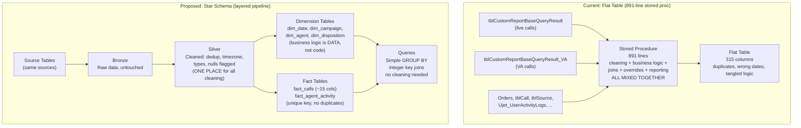

# Star Schema Design — Why It Matters

---

## The 891-Line Stored Procedure

A real production call center has a reporting system. The system generates a report table — one massive flat table with 315 columns — by running a stored procedure that is 891 lines of SQL.

That stored procedure does 10 things in one script:

1. Unions two different source tables (live agent calls + virtual agent calls) with complex dedup logic to avoid double-counting
2. Patches date fields (overrides one date column with values from another)
3. Hard-codes program name overrides ("Emson" → "Bullseye Pro English") for specific clients
4. Filters training calls from real calls using a phone number lookup table
5. Joins order data (finds the latest order per call, pulls revenue/tax/shipping)
6. Maps 15+ failure reason codes to human-readable disposition names using 50 lines of CASE WHEN statements
7. Normalizes deflection messages (converts internal codes to labels)
8. Expands agent time data using a CROSS JOIN of agents × 24 hours — creating rows for every possible agent-hour combination
9. Merges calls + agent hours + agent activity into one giant temp table using FULL OUTER JOINs
10. Applies client-specific revenue overrides (one client gets revenue from table A, another from table B)

The result: 315 columns per row. Every possible reporting field pre-joined into one flat structure.

---

## The Bugs This Approach Creates

This system has known bugs that have been pending fixes for months:

**Bug 1: Wrong date field.** The stored procedure populates `va_callstartedat` from `callendedat` instead of `callstartedat`. Every VA call shows the wrong start time. The fix is changing one word in two SQL files — but finding WHERE the wrong value comes from requires tracing through 891 lines of temp table manipulations.

**Bug 2: Timezone display.** Reports show dates in UTC instead of Eastern Standard Time. A call made at 9 PM EST on March 2nd shows as March 3rd in the report (because 9 PM EST = 2 AM UTC the next day). The timezone conversion exists in the stored proc — but it is applied inconsistently across the 10 steps.

**Bug 3: Duplicate rows.** The flat table has duplicate rows for some calls. The UNION + FULL OUTER JOIN logic in steps 1 and 9 creates them. Every downstream query must dedup, and every analyst must know about this.

None of these bugs are hard to fix in isolation. They are hard to find because **the logic is tangled.** Cleaning, business rules, joins, overrides, and reporting are all in one script. A change on line 185 affects the output on line 800 in ways that require reading the entire procedure to understand.

---

## What a Star Schema Solves

The star schema separates concerns:

| Concern | Flat Table Approach | Star Schema Approach |
|:---|:---|:---|
| **Data cleaning** (dedup, timezone, null handling) | Mixed into the stored proc alongside business logic | Handled once in the **Silver layer** pipeline. Downstream tables are already clean. |
| **Business logic** (disposition mapping, program name overrides, client-specific revenue) | 50 lines of CASE WHEN, hard-coded call IDs, client IF/ELSE blocks | Stored in **dimension tables**. The mapping is data, not code. Change a dimension row, not a stored proc. |
| **Report generation** (agent hours, cross joins, final SELECT) | Part of the same 891-line script | Queries run against the star schema at runtime. Simple GROUP BY with integer key joins. |

When Bug 1 happens in a star schema world: the timezone conversion lives in exactly one place — the Silver→Gold pipeline that populates `dim_date`. Fix it there, every downstream query is correct. No tracing through 891 lines.

When Bug 3 happens: the dedup logic lives in the Silver layer. The fact table has a unique constraint on `call_key`. Duplicates are impossible by design. No analyst needs to remember to dedup.

---

## The Architecture

---

## What This Means Practically

| Scenario | Flat Table | Star Schema |
|:---|:---|:---|
| "Add a new media source report" | Modify the stored proc to add columns. Hope it does not break the existing 315. Redeploy. | Add a column to `dim_campaign`. No stored proc changes. No redeployment. |
| "Why does March 3rd show 200 calls but the VA dashboard shows 180?" | Trace through 891 lines to find which step miscounts. Is it the dedup? The timezone? The UNION? The FULL OUTER JOIN? | Check: is the fact table count correct? (If yes, the query is wrong. If no, the Silver pipeline has a bug.) Two places to look, not 891 lines. |
| "We signed a new client. Add their custom revenue logic." | Add another client-specific IF block to the stored proc. It is now 920 lines. | Add the client to `dim_campaign`. If their revenue comes from a different source, add a config row to a revenue-source mapping table. The pipeline handles it. |
| "The CEO asks for conversion rate by media source by hour by day of week" | The flat table has these columns but the analyst must know: use `HourOfDay` (not `Hour`), filter out `FailReason NOT IN (10001, ...)`, dedup by `id`, handle VA separately. | `SELECT dc.media_source, dd.day_name, dt.hour, COUNT(CASE WHEN f.is_order THEN 1 END) / COUNT(*) FROM fact_calls f JOIN dim_campaign dc ... JOIN dim_date dd ... JOIN dim_time dt ... GROUP BY ...` |

---

**Next:** [02 — The Star Schema Design](02_Design.md) — The actual table structures, column definitions, and how each dimension replaces a section of the stored procedure.
