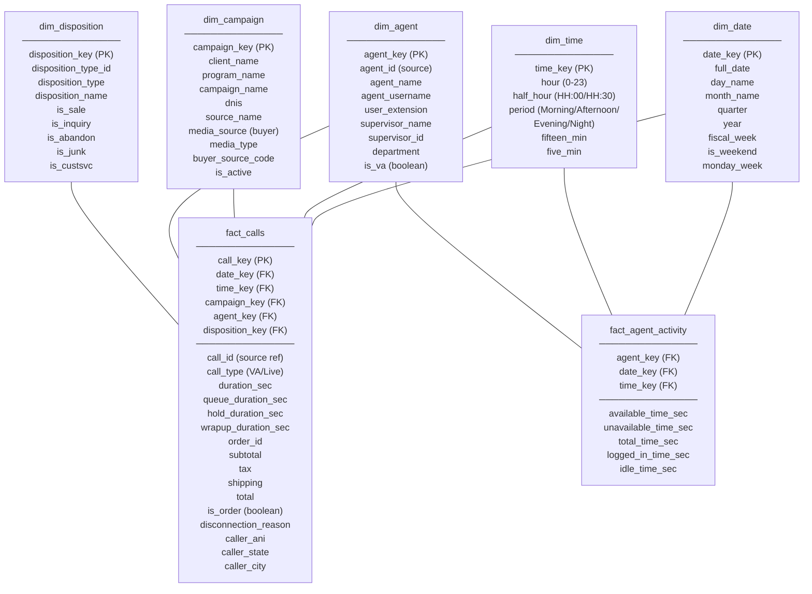
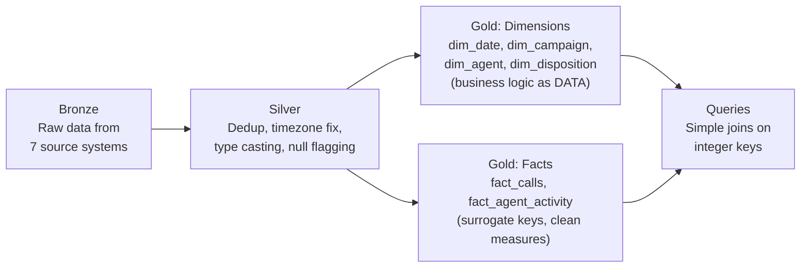

# Star Schema Design — The Tables

**Every table, every column, and which part of the 891-line stored procedure it replaces.**

---

## The Complete Schema



---

## Dimension Tables — What Each One Replaces

### dim_date — Replaces Inline Timezone Conversion

**What the stored proc does today:**
```sql
-- Scattered throughout the 891 lines:
SET @fromDate = @fromDate AT TIME ZONE 'Eastern Standard Time' AT TIME ZONE 'UTC';
-- ...later...
UPDATE #temp21 SET date = va_callstartedat  -- overrides date for VA calls
-- ...later...
CONVERT(CHAR(10), CAST(DATEADD(HOUR, -4, u.StartedAt) AS date), 101) AS AgentDay
-- Three different timezone approaches in one script
```

**What dim_date does:**
```sql
-- Built ONCE by the pipeline. Every date pre-computed.

CREATE TABLE dim_date (
    date_key        INT PRIMARY KEY,       -- 20260315 (YYYYMMDD integer for fast joins)
    full_date       DATE NOT NULL,
    full_date_est   DATE NOT NULL,          -- Already converted from UTC to EST
    day_name        VARCHAR(10),            -- Monday, Tuesday, ...
    day_of_week     INT,                    -- 1=Sunday, 7=Saturday
    month_num       INT,
    month_name      VARCHAR(10),            -- January, February, ...
    quarter         INT,                    -- 1, 2, 3, 4
    year            INT,
    fiscal_week     VARCHAR(10),            -- Monday-start week label
    is_weekend      BOOLEAN,
    monday_week     DATE                    -- Monday of the week this date falls in
);

-- Populated for the full year: 365 rows. One-time.
-- Timezone conversion happens HERE, not in every query.
```

**The bug it prevents:** Bug #2 (UTC vs EST) is impossible. The pipeline converts UTC → EST when populating `dim_date`. Every downstream query uses `full_date_est`. One conversion, one place, always correct.

---

### dim_time — Replaces Inline Hour/Half-Hour Extraction

**What the stored proc does today:**
```sql
-- The flat table has columns: HourOfDay, Half Hour, 15Minute, 10Minute, 5Minute
-- Plus 48 columns for half-hour call counts (00:00, 00:30, 01:00, 01:30, ...)
-- Plus 48 columns for half-hour order counts
-- That is 96+ columns just for time-of-day breakdowns
```

**What dim_time does:**
```sql
CREATE TABLE dim_time (
    time_key        INT PRIMARY KEY,        -- 0-23 (hour)
    hour            INT,
    half_hour       VARCHAR(5),             -- '14:00', '14:30'
    fifteen_min     VARCHAR(5),             -- '14:00', '14:15', '14:30', '14:45'
    five_min        VARCHAR(5),
    period          VARCHAR(10)             -- 'Morning', 'Afternoon', 'Evening', 'Night'
);

-- 24 rows. The 96 half-hour columns in the flat table become:
-- GROUP BY dt.half_hour in a query. No extra columns needed.
```

**What it eliminates:** 96 columns in the flat table (half-hour call counts + half-hour order counts). A single `GROUP BY dt.half_hour` replaces all of them.

---

### dim_campaign — Replaces Hard-Coded Program Name Overrides

**What the stored proc does today:**
```sql
-- Line 185-189:
UPDATE t
SET t.programName = 'Bullseye Pro English'
FROM #temp21 t
WHERE t.client = 'Emson' AND t.programName = 'Emson' AND t.va_callid IS NOT NULL;

-- Line 455-458:
UPDATE t
SET t.programName = 'Ellipse Fit English', t.campaignName = 'Ellipse Fit English'
FROM #temp11 t
WHERE t.id IN (1094758, 1085870, 1090805);  -- HARD-CODED CALL IDs
```

**What dim_campaign does:**
```sql
CREATE TABLE dim_campaign (
    campaign_key        INT PRIMARY KEY,     -- Surrogate key
    client_name         VARCHAR(100),
    program_name        VARCHAR(100),        -- The CORRECT name, maintained as data
    campaign_name       VARCHAR(100),
    dnis                VARCHAR(20),         -- The phone number that routes to this campaign
    source_name         VARCHAR(100),
    media_source        VARCHAR(100),        -- The buyer / media company
    media_type          VARCHAR(50),         -- TV, Digital, Radio, etc.
    buyer_source_code   VARCHAR(64),
    is_active           BOOLEAN
);

-- "Emson" → "Bullseye Pro English" is a row in this table.
-- Not a line of code. If the name changes, update one row.
-- No stored proc modification. No deployment.
```

**What it eliminates:** Hard-coded overrides scattered through the stored proc. The mapping is data. When a new client onboards or a program name changes, update the dimension table — not the SQL.

---

### dim_agent — Replaces Agent-Hour CROSS JOIN Expansion

**What the stored proc does today (150 lines):**
```sql
-- Step 8: Create a CROSS JOIN of agents × 24 hours
-- Step 9: FULL OUTER JOIN calls with agent-hours with agent-activity
-- This creates a row for every agent × every hour, even if no call happened
-- Purpose: calculate utilization (available time vs on-call time vs idle time)
```

**What the star schema does:**
```sql
CREATE TABLE dim_agent (
    agent_key           INT PRIMARY KEY,
    agent_id            INT,                 -- Source system ID
    agent_name          VARCHAR(100),
    agent_username      VARCHAR(50),
    user_extension      VARCHAR(10),
    supervisor_name     VARCHAR(100),
    supervisor_id       INT,
    department          VARCHAR(50),
    is_va               BOOLEAN              -- TRUE for virtual agents
);

-- Agent TIME data goes in a separate fact table:
CREATE TABLE fact_agent_activity (
    agent_key           INT REFERENCES dim_agent,
    date_key            INT REFERENCES dim_date,
    time_key            INT REFERENCES dim_time,
    available_time_sec  INT,
    unavailable_time_sec INT,
    total_time_sec      INT,
    logged_in_time_sec  INT,
    idle_time_sec       INT
);
```

**What it eliminates:** The CROSS JOIN expansion and FULL OUTER JOIN in the stored proc. Agent activity is a separate fact table — join it to `fact_calls` when needed for utilization reports, ignore it otherwise. The 150 lines of agent-time logic become a simple pipeline step that populates `fact_agent_activity`.

---

### dim_disposition — Replaces 50 Lines of CASE WHEN

**What the stored proc does today:**
```sql
-- Lines 391-432:
UPDATE t SET
    t.DispoType = CASE
        WHEN t.FailReason = 10001 AND t.status = 9  THEN 'failed_unknown_status_9'
        WHEN t.FailReason = 11001 AND t.status = 9  THEN 'connection_time_out'
        WHEN t.FailReason = 20003 AND t.status = 9  THEN 'eu_abandoned'
        -- ... 15 more WHEN clauses ...
    END,
    t.DispoName = CASE
        WHEN t.FailReason = 10001 AND t.status = 9  THEN 'ABANDON'
        WHEN t.FailReason = 11001 AND t.status = 9  THEN 'ABANDON'
        -- ... 15 more WHEN clauses ...
    END
```

**What dim_disposition does:**
```sql
CREATE TABLE dim_disposition (
    disposition_key     INT PRIMARY KEY,
    fail_reason         INT,
    status              INT,
    disposition_type    VARCHAR(50),          -- 'eu_abandoned', 'connection_time_out', etc.
    disposition_name    VARCHAR(20),          -- 'ABANDON', 'ORDER', 'IVR', etc.
    is_sale             BOOLEAN,
    is_inquiry          BOOLEAN,
    is_abandon          BOOLEAN,
    is_junk             BOOLEAN,
    is_custsvc          BOOLEAN
);

-- The 50-line CASE WHEN becomes a lookup table:
-- INSERT INTO dim_disposition VALUES (1, 10001, 9, 'failed_unknown_status_9', 'ABANDON', false, false, true, false, false);
-- INSERT INTO dim_disposition VALUES (2, 11001, 9, 'connection_time_out', 'ABANDON', false, false, true, false, false);
-- ...

-- In the pipeline:
-- fact_calls.disposition_key = dim_disposition.disposition_key
-- (matched by fail_reason + status during Gold layer build)
```

**What it eliminates:** 50 lines of CASE WHEN logic. Adding a new disposition type is an INSERT, not a code change.

---

## The Fact Table — What It Contains

```sql
CREATE TABLE fact_calls (
    -- Keys
    call_key            INT PRIMARY KEY,     -- Surrogate key
    date_key            INT REFERENCES dim_date,
    time_key            INT REFERENCES dim_time,
    campaign_key        INT REFERENCES dim_campaign,
    agent_key           INT REFERENCES dim_agent,
    disposition_key     INT REFERENCES dim_disposition,

    -- Source reference (for tracing back to original systems)
    call_id             VARCHAR(100),        -- Original call_id (from TSN_VA_Calls or tblCall)
    voiceprint_id       VARCHAR(50),         -- tblCall.VoicePrintID
    call_type           VARCHAR(10),         -- 'VA' or 'Live'

    -- Measures
    duration_sec        INT,
    queue_duration_sec  INT,
    hold_duration_sec   INT,
    wrapup_duration_sec INT,

    -- Order data (denormalized for query convenience)
    order_id            INT,
    subtotal            DECIMAL(10,2),
    tax                 DECIMAL(10,2),
    shipping            DECIMAL(10,2),
    total               DECIMAL(10,2),
    is_order            BOOLEAN,             -- TRUE if disposition is a sale

    -- Call metadata
    disconnection_reason VARCHAR(50),
    caller_ani          VARCHAR(20),
    caller_state        VARCHAR(10),
    caller_city         VARCHAR(50)
);
```

**One row per call.** Unique on `call_key`. No duplicates by design — the Silver layer deduplicates, and the surrogate key is generated by the pipeline.

**315 columns → ~25 columns.** The other 290 columns in the flat table are either:
- Dimension attributes (now in dimension tables, joined when needed)
- Time-bucketed aggregations (now computed at query time via GROUP BY)
- Agent activity metrics (now in `fact_agent_activity`)

---

## The Pipeline That Builds It



Each step is independent. The Silver pipeline can run without the Gold pipeline. The Gold pipeline can run without the queries. A bug in one layer is isolated — it does not cascade through 891 lines.

---

## The Comparison Table

| Aspect | 891-Line Stored Proc | Star Schema |
|:---|:---|:---|
| **Lines of SQL** | 891 | ~100 (pipeline) + ~50 (table DDL) |
| **Columns per row** | 315 | ~25 (fact) + dimensions joined when needed |
| **Timezone handling** | 3 different approaches in one script | One conversion in Silver, used everywhere |
| **Dedup** | Analyst must remember. Duplicates exist. | Unique key on fact table. Impossible by design. |
| **Disposition mapping** | 50 lines of CASE WHEN | Lookup table. One INSERT per new type. |
| **Program name overrides** | Hard-coded in SQL | Data in dim_campaign. Update a row. |
| **Agent utilization** | 150-line CROSS JOIN expansion | Separate fact table. Join when needed. |
| **Adding a new report field** | Modify stored proc. Test. Deploy. Pray. | Add column to one dimension. Or add to the query. |
| **Finding a bug** | Read 891 lines. Trace through 10 temp tables. | Check: is it in Silver (cleaning)? Gold (business logic)? Query? Three places. |
| **Onboarding a new developer** | "Read the stored proc. Good luck." | "Bronze is raw. Silver is clean. Gold is modeled. Query the star schema." |

---

**Next:** [03 — Building It](03_Building_It.md) — How to build this star schema on BigQuery, step by step, from the call center data.
