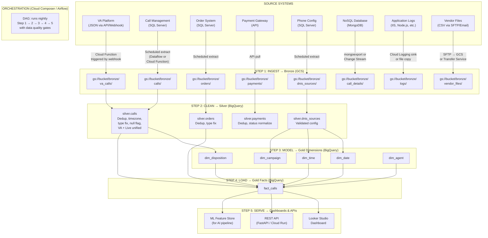

# Star Schema Design — The End-to-End Pipeline

**From source systems to dashboards — every step, every tool, every decision.**

---

## The Complete Flow



---

## Step 1: INGEST — Source Systems → Bronze (GCS)

**Goal:** Get raw data from every source system into cloud storage. No transformation. Exact copy.

**Where it lands:** GCS (Google Cloud Storage) bucket, organized by source and date.

```
gs://call-center-pipeline/
  bronze/
    va_calls/
      2026-04-03/va_calls_20260403.json       ← Daily extract from VA platform API
    calls/
      2026-04-03/calls_20260403.csv           ← Daily extract from SQL Server
    orders/
      2026-04-03/orders_20260403.csv
    payments/
      2026-04-03/payments_20260403.csv
    call_details/
      2026-04-03/call_details_20260403.json   ← Daily mongoexport from MongoDB
    logs/
      2026-04-03/app_logs_20260403.jsonl      ← Application logs (JSON lines)
    vendor_files/
      media_reports/
        2026-04-03/mediabuy_report_20260403.csv  ← Vendor CSV (uploaded via SFTP or Transfer Service)
    dnis_sources/
      dnis_sources_latest.csv                  ← Config table — overwritten, not partitioned by date
```

### How Data Gets Into Bronze

| Source | Format | Ingestion Method | GCP Service | Trigger |
|:---|:---|:---|:---|:---|
| **VA Platform** (real-time) | JSON via webhook | Webhook hits a Cloud Function that writes to GCS | **Cloud Functions** | Event: VA platform sends `call_analyzed` webhook |
| **SQL Server tables** (batch) | CSV extract | Extract query dumps CSV to GCS | **Dataflow** or **Cloud Function** with SQL connector | Schedule: Cloud Scheduler at 2 AM daily |
| **API sources** (payments, third-party) | JSON via REST | Cloud Function calls API, writes response to GCS | **Cloud Functions** | Schedule: Cloud Scheduler |
| **MongoDB** (NoSQL) | JSON (nested documents) | `mongoexport` to JSON file → upload to GCS. Or use MongoDB **Change Streams** for real-time CDC (Change Data Capture) → Cloud Function → GCS | **Cloud Functions** or **Dataflow** (for streaming) | Schedule (batch) or Change Stream event (real-time) |
| **Application Logs** (IIS, Node.js, Python) | JSON lines, plain text | **Cloud Logging** collects logs automatically from GCP services. For non-GCP servers: install the Logging agent, or write logs to files and copy to GCS via cron. | **Cloud Logging** + **Log Sink** (routes logs to GCS/BigQuery) | Continuous (streaming) or schedule (batch file copy) |
| **Vendor CSV files** (media reports, invoices) | CSV via email or SFTP | Multiple options (see below) | **Transfer Service** or **SFTP-to-GCS gateway** | On file arrival or schedule |
| **Config/lookup tables** (DNIS mapping) | CSV | Full extract — small table, overwrite daily | **Cloud Function** or manual upload | Schedule or on-change |

### How Vendor CSV Files Get Into GCS

Vendors (media buyers, fulfillment companies, partners) send CSV files. They are not going to use `gcloud` CLI or the GCP Console. Common patterns:

| Pattern | How It Works | When to Use |
|:---|:---|:---|
| **SFTP Gateway → GCS** | Set up an SFTP server (e.g., on a small VM or using a managed service). Vendor uploads via SFTP (they already know how). A cron job or Cloud Function moves files from the SFTP server to GCS. | Vendor is technical enough for SFTP. Most common in enterprise. |
| **Storage Transfer Service** | GCP's built-in service that copies files from an SFTP server, S3 bucket, HTTP endpoint, or another GCS bucket into your bucket — on a schedule. No code needed. | Vendor has their own server/S3 and you pull from them on schedule. |
| **Email attachment → Cloud Function** | Vendor emails the CSV. A Cloud Function triggered by Gmail/Pub/Sub (via an email integration) parses the attachment and uploads to GCS. | Small vendors who can only email. Less reliable — attachments can be malformed. |
| **Signed URL upload** | Generate a time-limited URL that allows upload to a specific GCS path without GCP credentials. Send the URL to the vendor. They upload via browser or `curl`. | One-off uploads. Vendor needs no GCP account. |
| **Partner Portal (web UI)** | Build a simple web page (Cloud Run + FastAPI) with a file upload form. Vendor logs in, uploads CSV, it goes straight to GCS. | Multiple vendors uploading regularly. Best user experience. |
| **Google Drive → GCS** | Vendor drops file in a shared Google Drive folder. A Cloud Function syncs Drive → GCS on a schedule. | Very non-technical vendors. Consumer-grade but works. |

**Console UI:** Storage Transfer Service
1. Go to [console.cloud.google.com/transfer](https://console.cloud.google.com/transfer)
2. **Create Transfer Job** → Source: SFTP server (or S3, or HTTP) → Destination: your GCS bucket → Schedule → **Create**

**CLI: Generate a Signed URL for Vendor Upload**
```bash
# Generate a URL that allows upload for 1 hour — no GCP credentials needed
gcloud storage sign-url gs://call-center-pipeline/bronze/vendor_files/media_report.csv \
    --duration=1h --http-verb=PUT
# Send this URL to the vendor. They upload with:
# curl -X PUT -T their_file.csv "THE_SIGNED_URL"
```

### MongoDB Ingestion Details

MongoDB stores documents as nested JSON — not flat rows. A single call record in MongoDB might look like:

```json
{
  "call_id": "CALL-001",
  "customer": {
    "name": "Jane Doe",
    "address": { "city": "Austin", "state": "TX" }
  },
  "products": [
    {"sku": "SP-STD", "qty": 1, "price": 59.99},
    {"sku": "SP-CASE", "qty": 1, "price": 19.99}
  ]
}
```

**Batch ingestion (simple):**
```bash
# Export from MongoDB to a JSON file
mongoexport --uri="mongodb://host:27017/callcenter" \
    --collection=calls \
    --out=calls_export.json \
    --jsonArray

# Upload to GCS
gcloud storage cp calls_export.json gs://call-center-pipeline/bronze/call_details/2026-04-03/
```

**Real-time ingestion (advanced — CDC with Change Streams):**
MongoDB **Change Streams** emit an event every time a document is inserted, updated, or deleted. A listener (Cloud Function or Dataflow) captures each event and writes it to GCS or directly to BigQuery.

```python
# Simplified Change Stream listener
from pymongo import MongoClient
from google.cloud import storage

client = MongoClient("mongodb://host:27017")
db = client.callcenter

# Watch for new call records
with db.calls.watch() as stream:
    for change in stream:
        if change["operationType"] == "insert":
            doc = change["fullDocument"]
            # Write to GCS
            blob = bucket.blob(f"bronze/call_details/{doc['call_id']}.json")
            blob.upload_from_string(json.dumps(doc))
```

**The flattening happens in Silver, not Bronze.** Bronze stores the nested JSON as-is. The Silver layer flattens `customer.address.city` into `customer_address_city` using `JSON_EXTRACT` in BigQuery or `pd.json_normalize()` in Python.

### Application Log Ingestion

Logs from web servers (IIS), application servers (Node.js, Python), and cloud services contain valuable data: error rates, response times, user actions, system events.

**For GCP-hosted applications:**
Cloud Logging collects logs automatically. Route them to GCS or BigQuery using a **Log Sink:**

1. Go to [console.cloud.google.com/logs/router](https://console.cloud.google.com/logs/router)
2. **Create Sink** → name: `logs-to-gcs` → Destination: GCS bucket → Filter: `resource.type="cloud_run_revision"` (or whatever you want) → **Create**
3. Logs matching the filter are automatically exported to GCS

**For non-GCP servers (on-premise, other cloud):**
- Install the **Cloud Logging agent** (fluentd-based) on the server — it ships logs to Cloud Logging
- Or write logs to files and use a cron job to copy them to GCS:
  ```bash
  # Cron: every hour, copy today's logs to GCS
  0 * * * * gcloud storage cp /var/log/app/app.log gs://call-center-pipeline/bronze/logs/$(date +\%Y-\%m-\%d)/
  ```

**In BigQuery:** Logs exported to BigQuery can be queried directly:
```sql
-- Find all errors in the last hour
SELECT timestamp, jsonPayload.message, jsonPayload.error
FROM `project.logs.app_logs`
WHERE timestamp > TIMESTAMP_SUB(CURRENT_TIMESTAMP(), INTERVAL 1 HOUR)
AND severity = 'ERROR';
```

### GCP Console UI: Setting Up the Bucket

1. Go to [console.cloud.google.com/storage](https://console.cloud.google.com/storage)
2. **Create Bucket** → name: `call-center-pipeline` → location: `us-central1` → **Create**
3. Inside the bucket, **Create Folder**: `bronze`
4. Inside `bronze`, create folders: `va_calls`, `calls`, `orders`, `payments`, `dnis_sources`

### CLI

```bash
gcloud storage buckets create gs://call-center-pipeline/ --location=us-central1
gcloud storage cp data/calls.json gs://call-center-pipeline/bronze/va_calls/
gcloud storage cp data/campaigns.csv gs://call-center-pipeline/bronze/dnis_sources/
gcloud storage cp data/orders.csv gs://call-center-pipeline/bronze/orders/
gcloud storage cp data/products.csv gs://call-center-pipeline/bronze/products/
```

### Cloud Function Example: Ingest VA Calls from Webhook

```python
# cloud_function_ingest_va.py
# Triggered when the VA platform sends a call_analyzed webhook
# Writes the raw JSON to GCS Bronze layer

import json
from google.cloud import storage
from datetime import datetime

def ingest_va_call(request):
    """Cloud Function triggered by HTTP webhook from VA platform."""
    call_data = request.get_json()
    call_id = call_data.get("call_id", "unknown")
    today = datetime.utcnow().strftime("%Y-%m-%d")

    # Write raw JSON to GCS — no transformation
    client = storage.Client()
    bucket = client.bucket("call-center-pipeline")
    blob = bucket.blob(f"bronze/va_calls/{today}/{call_id}.json")
    blob.upload_from_string(json.dumps(call_data), content_type="application/json")

    return {"status": "ingested", "call_id": call_id}, 200
```

### GCS Event Trigger (Alternative: Trigger Pipeline When File Lands)

Instead of scheduling, the pipeline can trigger when new data arrives:

```bash
# Create a Cloud Function that triggers when a file lands in bronze/
gcloud functions deploy trigger_pipeline \
    --runtime python310 \
    --trigger-resource call-center-pipeline \
    --trigger-event google.storage.object.finalize \
    --entry-point on_file_uploaded
```

This fires every time a new file is uploaded to the bucket. The function checks which folder the file landed in and triggers the appropriate pipeline step.

---

## Step 2: CLEAN — Bronze → Silver (BigQuery)

**Goal:** Load raw data from GCS into BigQuery, clean it, and produce a unified, deduplicated dataset.

### Two Ways to Access Bronze Data in BigQuery

**Option A: Load into BigQuery (native tables)** — copies data from GCS into BigQuery storage. Fastest queries. Use for Silver/Gold layers and production reports.

```bash
# Load from GCS into BigQuery native tables (auto-detect schema)
bq load --autodetect --replace --source_format=NEWLINE_DELIMITED_JSON \
    raw.va_calls gs://call-center-pipeline/bronze/va_calls/2026-04-03/*.json

bq load --autodetect --replace --source_format=CSV \
    raw.calls gs://call-center-pipeline/bronze/calls/2026-04-03/*.csv

bq load --autodetect --replace --source_format=CSV \
    raw.orders gs://call-center-pipeline/bronze/orders/2026-04-03/*.csv

bq load --autodetect --replace --source_format=CSV \
    raw.dnis_sources gs://call-center-pipeline/bronze/dnis_sources/*.csv
```

**Option B: External tables (query GCS directly)** — no copying. BigQuery reads from GCS at query time. Data stays in GCS. Like AWS Athena querying S3.

```sql
-- Create an external table pointing to GCS — no data copied
CREATE OR REPLACE EXTERNAL TABLE raw.va_calls_external
OPTIONS (
    format = 'JSON',
    uris = ['gs://call-center-pipeline/bronze/va_calls/2026-04-03/*.json']
);

-- Query it like any BigQuery table — reads from GCS on every query
SELECT call_id, duration, disposition
FROM raw.va_calls_external
LIMIT 10;

-- External table for CSV files
CREATE OR REPLACE EXTERNAL TABLE raw.orders_external
OPTIONS (
    format = 'CSV',
    uris = ['gs://call-center-pipeline/bronze/orders/2026-04-03/*.csv'],
    skip_leading_rows = 1    -- skip the CSV header row
);

-- Wildcard: query ALL dates at once (scans all date folders)
CREATE OR REPLACE EXTERNAL TABLE raw.va_calls_all_dates
OPTIONS (
    format = 'JSON',
    uris = ['gs://call-center-pipeline/bronze/va_calls/*/*.json']
);
```

**Console UI: Create External Table**
1. BigQuery → `raw` dataset → **Create Table**
2. Source: **Google Cloud Storage**
3. URI: `gs://call-center-pipeline/bronze/va_calls/2026-04-03/*.json`
4. File format: **JSON (Newline delimited)**
5. **Table type: External table** (not the default "Native table")
6. Auto-detect schema → **Create Table**
7. Click the table → **Preview** to see data (reads from GCS live)

### When to Use Which

| | External Table (query GCS directly) | Native Table (bq load) |
|:---|:---|:---|
| **Speed** | Slower — reads from GCS every query | Faster — data in BigQuery columnar storage, optimized |
| **Storage cost** | Cheaper (GCS rates: ~$0.02/GB/month) | More expensive (BQ rates: ~$0.02/GB/month but also query storage costs) |
| **Query cost** | More expensive per query (slower scan, more bytes read) | Cheaper per query (columnar format, partitioning, clustering) |
| **Data freshness** | Always current — reads GCS at query time. New file lands → immediately queryable. | Stale until next `bq load` run |
| **Use for** | Bronze exploration ("what arrived today?"), ad-hoc investigation, one-time queries | Silver and Gold layers, dashboards, production reports, star schema |
| **AWS equivalent** | Athena + Glue Catalog querying S3 | Redshift COPY from S3 |

**For our pipeline:** External tables for Bronze (explore, validate). Native tables for Silver and Gold (performance matters for repeated queries and dashboards).

### The GCS Folder Date — How the Pipeline Uses It

The date folders (`2026-04-03/`) are not just organization — the pipeline uses them to process only new data:

```python
# In the Airflow DAG, {{ ds }} = the execution date
load_task = GCSToBigQueryOperator(
    source_objects=['bronze/va_calls/{{ ds }}/*.json'],  # Only today's files
    ...
)
```

Without date folders: the pipeline reprocesses ALL files every run (wasteful at scale).
With date folders: process only today's new data. Yesterday's data is already in Silver/Gold.

This also enables **reprocessing**: if March 15th's data was wrong, re-run the pipeline for just that date: `bronze/va_calls/2026-03-15/*.json` → re-clean → re-load into Silver/Gold. No other dates are affected.

### Console UI: External Tables (Alternative — Query GCS Directly)

BigQuery can query files in GCS without loading them first — **external tables:**

1. BigQuery → **Create Table** → Source: **Google Cloud Storage**
2. URI: `gs://call-center-pipeline/bronze/va_calls/*.json`
3. File format: **JSON (Newline delimited)**
4. Table type: **External table** (not native — data stays in GCS)
5. This avoids the load step for ad-hoc exploration, but is slower for repeated queries

### Silver Transformation: Clean and Unify

```sql
-- Create Silver dataset
CREATE SCHEMA IF NOT EXISTS silver OPTIONS (location = 'us-central1');

-- Silver calls: dedup, timezone, type fix, union VA + Live, flag nulls
CREATE OR REPLACE TABLE silver.calls AS

WITH va_cleaned AS (
    SELECT
        call_id,
        CAST(dnis AS STRING) AS dnis,
        caller_phone AS caller_ani,
        -- Timezone: convert UTC → local ONCE, here in Silver
        DATETIME(start_time, 'US/Eastern') AS call_started_local,
        DATETIME(end_time, 'US/Eastern') AS call_ended_local,
        DATE(DATETIME(start_time, 'US/Eastern')) AS call_date_local,
        EXTRACT(HOUR FROM DATETIME(start_time, 'US/Eastern')) AS call_hour_local,
        duration AS duration_sec,
        LOWER(TRIM(disposition)) AS disposition,
        channel AS call_type,
        -- Flag nulls (don't drop)
        duration IS NULL AS has_missing_duration,
        disposition IS NULL AS has_missing_disposition,
        -- Dedup: keep first occurrence per call_id
        ROW_NUMBER() OVER (PARTITION BY call_id ORDER BY start_time) AS row_num
    FROM raw.va_calls
),

-- Add similar CTE for live calls if in a separate table:
-- live_cleaned AS ( ... ),

deduplicated AS (
    SELECT * FROM va_cleaned WHERE row_num = 1
    -- UNION ALL
    -- SELECT * FROM live_cleaned WHERE row_num = 1
)

SELECT * EXCEPT(row_num) FROM deduplicated;

-- Silver orders: dedup, type fix
CREATE OR REPLACE TABLE silver.orders AS
SELECT
    *,
    ROW_NUMBER() OVER (PARTITION BY order_id ORDER BY order_date DESC) AS row_num
FROM raw.orders
QUALIFY row_num = 1;

-- Verify Silver
SELECT
    COUNT(*) AS total_calls,
    COUNTIF(has_missing_duration) AS missing_duration,
    COUNTIF(has_missing_disposition) AS missing_disposition,
    COUNT(DISTINCT call_id) AS unique_calls
FROM silver.calls;
```

**What Silver guarantees:**
- Every call_id appears exactly once (deduplicated)
- Timestamps are in local time (timezone converted)
- Data types are correct (strings → dates, etc.)
- Nulls are flagged with boolean columns (not dropped)
- VA + Live calls are in one table with a `call_type` column
- The Silver table IS the input to both Gold (analytics) and ML (feature engineering)

---

## Step 3: MODEL — Silver → Gold Dimensions (BigQuery)

**Goal:** Build the dimension tables that provide context to the fact table.

```sql
CREATE SCHEMA IF NOT EXISTS gold OPTIONS (location = 'us-central1');
```

The dimension CREATE TABLE statements are in [03_Building_It.md](03_Building_It.md) — `dim_date`, `dim_time`, `dim_campaign`, `dim_disposition`. Run them in this step.

**Key point:** Dimensions are mostly static or slowly changing. `dim_date` is built once for the year. `dim_campaign` changes when a new campaign launches. `dim_disposition` changes when a new outcome type is added. These are not rebuilt nightly — they are maintained as reference data.

---

## Step 4: LOAD — Silver + Dimensions → Gold Facts (BigQuery)

**Goal:** Build the fact table by joining Silver data to dimension keys.

```sql
CREATE OR REPLACE TABLE gold.fact_calls
PARTITION BY call_date_local
CLUSTER BY campaign_key
AS
SELECT
    ROW_NUMBER() OVER (ORDER BY s.call_id) AS call_key,

    -- Dimension keys (integer joins)
    CAST(FORMAT_DATE('%Y%m%d', s.call_date_local) AS INT64) AS date_key,
    s.call_hour_local AS time_key,
    dc.campaign_key,
    dd.disposition_key,

    -- Source reference
    s.call_id,
    s.call_type,
    s.call_date_local,

    -- Measures
    s.duration_sec,
    o.total AS order_total,
    o.order_id,
    CASE WHEN o.order_id IS NOT NULL THEN TRUE ELSE FALSE END AS is_order,

    -- Caller info
    s.dnis,
    s.caller_ani,

    -- Quality flags (carried from Silver)
    s.has_missing_duration,
    s.has_missing_disposition

FROM silver.calls s
LEFT JOIN gold.dim_campaign dc ON s.dnis = dc.dnis
LEFT JOIN gold.dim_disposition dd ON s.disposition = LOWER(dd.disposition_name)
LEFT JOIN silver.orders o ON s.call_id = o.call_id;
```

---

## Step 5: VERIFY — Data Quality Gates

**Goal:** Before anyone queries the Gold tables, verify the pipeline produced correct results.

```sql
-- Gate 1: No duplicate call_ids in fact table
SELECT call_id, COUNT(*) AS dupes
FROM gold.fact_calls
GROUP BY call_id HAVING COUNT(*) > 1;
-- Expected: 0 rows

-- Gate 2: No orphan dimension keys (calls without a campaign match)
SELECT COUNT(*) AS orphan_campaigns
FROM gold.fact_calls WHERE campaign_key IS NULL;
-- Expected: 0 (or a known small number — investigate any non-zero result)

-- Gate 3: Row count matches Silver
SELECT 'silver' AS layer, COUNT(*) AS rows FROM silver.calls
UNION ALL
SELECT 'gold', COUNT(*) FROM gold.fact_calls;
-- Expected: same count (or Gold is slightly less if some calls dropped during join)

-- Gate 4: Revenue matches
SELECT
    'silver_orders' AS source, SUM(total) AS revenue FROM silver.orders
UNION ALL
SELECT 'gold_facts', SUM(order_total) FROM gold.fact_calls WHERE is_order;
-- Expected: same total

-- Gate 5: Date range is complete (no missing days)
SELECT dd.full_date, COUNT(f.call_key) AS calls
FROM gold.dim_date dd
LEFT JOIN gold.fact_calls f ON dd.date_key = f.date_key
WHERE dd.full_date BETWEEN '2026-03-15' AND '2026-03-31'
GROUP BY dd.full_date
ORDER BY dd.full_date;
-- Eyeball: any day with 0 calls when there should be some?
```

**If any gate fails:** The pipeline stops. The old Gold tables remain. No bad data reaches dashboards. Investigate, fix, re-run.

---

## Step 6: SERVE — Gold → Dashboards, APIs, ML

### Option A: Looker Studio Dashboard (GCP Native — Free)

**Looker Studio** (formerly Google Data Studio) connects directly to BigQuery.

1. Go to [lookerstudio.google.com](https://lookerstudio.google.com)
2. **Create → Data Source → BigQuery**
3. Select project → `gold` dataset → `fact_calls` table
4. **Add join:** dim_campaign (on campaign_key), dim_date (on date_key)
5. Build charts: bar chart for campaign conversion, line chart for hourly volume, scorecard for total revenue

| Dashboard Panel | Query Behind It |
|:---|:---|
| **Campaign Conversion Rate** | `GROUP BY campaign_name` → bar chart |
| **Hourly Call Volume** | `GROUP BY hour` → line chart |
| **Revenue by Client** | `GROUP BY client_name, SUM(order_total)` → pie chart |
| **Day-of-Week Pattern** | `GROUP BY day_name` → bar chart |
| **Data Quality Scorecard** | `COUNTIF(campaign_key IS NULL)` → red/green indicator |

### Option B: REST API (Cloud Run + FastAPI)

For applications that need to query the star schema programmatically:

```python
# api.py — FastAPI serving Gold data via REST
from fastapi import FastAPI, Query
from google.cloud import bigquery

app = FastAPI()
client = bigquery.Client()

@app.get("/api/campaign-performance")
def campaign_performance(month: str = Query(default="March")):
    query = f"""
    SELECT dc.campaign_name, dc.channel,
           COUNT(*) AS calls, COUNTIF(f.is_order) AS orders,
           ROUND(COUNTIF(f.is_order)/COUNT(*)*100, 1) AS conversion_pct,
           ROUND(SUM(f.order_total), 2) AS revenue
    FROM gold.fact_calls f
    JOIN gold.dim_campaign dc ON f.campaign_key = dc.campaign_key
    JOIN gold.dim_date dd ON f.date_key = dd.date_key
    WHERE dd.month_name = '{month}'
    GROUP BY dc.campaign_name, dc.channel
    ORDER BY revenue DESC
    """
    results = client.query(query).to_dataframe()
    return results.to_dict(orient="records")
```

Deploy to Cloud Run:
```bash
gcloud run deploy call-center-api --source . --region us-central1 --allow-unauthenticated
```

### Option C: ML Feature Store

The ML pipeline reads from the same Gold tables. Feature extraction is one query:

```sql
-- Extract features for the ML model
SELECT
    f.duration_sec,
    dt.hour AS hour_of_day,
    dd.is_weekend,
    CASE WHEN dc.channel = 'VA' THEN 1 ELSE 0 END AS is_va,
    CASE WHEN f.is_order THEN 1 ELSE 0 END AS placed_order,
    f.order_total,
    f.is_order AS target_conversion  -- The label for the ML model
FROM gold.fact_calls f
JOIN gold.dim_campaign dc ON f.campaign_key = dc.campaign_key
JOIN gold.dim_date dd ON f.date_key = dd.date_key
JOIN gold.dim_time dt ON f.time_key = dt.time_key;
```

This is the bridge between the DE pipeline and the AI pipeline — same Gold tables, different consumer.

---

## Orchestration: Cloud Composer (Airflow)

All steps above run manually today. In production, they run automatically — scheduled nightly, with data quality gates between steps.

**Cloud Composer** is Google's managed Airflow service. An Airflow **DAG (Directed Acyclic Graph, pronounced "dag")** defines the pipeline:

```python
# dags/call_center_pipeline.py
from airflow import DAG
from airflow.providers.google.cloud.operators.bigquery import BigQueryInsertJobOperator
from airflow.providers.google.cloud.transfers.gcs_to_bigquery import GCSToBigQueryOperator
from airflow.operators.python import PythonOperator
from datetime import datetime, timedelta

default_args = {
    'owner': 'data-engineering',
    'retries': 2,
    'retry_delay': timedelta(minutes=5),
}

with DAG(
    'call_center_pipeline',
    default_args=default_args,
    schedule_interval='0 3 * * *',    # Run at 3 AM daily
    start_date=datetime(2026, 3, 1),
    catchup=False,
) as dag:

    # Step 1: Load Bronze → BigQuery raw tables
    load_va_calls = GCSToBigQueryOperator(
        task_id='load_va_calls',
        bucket='call-center-pipeline',
        source_objects=['bronze/va_calls/{{ ds }}/*.json'],
        destination_project_dataset_table='raw.va_calls',
        source_format='NEWLINE_DELIMITED_JSON',
        autodetect=True,
        write_disposition='WRITE_TRUNCATE',
    )

    load_orders = GCSToBigQueryOperator(
        task_id='load_orders',
        bucket='call-center-pipeline',
        source_objects=['bronze/orders/{{ ds }}/*.csv'],
        destination_project_dataset_table='raw.orders',
        source_format='CSV',
        autodetect=True,
        write_disposition='WRITE_TRUNCATE',
    )

    # Step 2: Bronze → Silver (dedup, timezone, clean)
    build_silver = BigQueryInsertJobOperator(
        task_id='build_silver',
        configuration={
            'query': {
                'query': open('sql/silver_calls.sql').read(),
                'useLegacySql': False,
            }
        },
    )

    # Step 3: Silver → Gold dimensions (refresh if needed)
    build_dimensions = BigQueryInsertJobOperator(
        task_id='build_dimensions',
        configuration={
            'query': {
                'query': open('sql/gold_dimensions.sql').read(),
                'useLegacySql': False,
            }
        },
    )

    # Step 4: Silver + Dimensions → Gold facts
    build_facts = BigQueryInsertJobOperator(
        task_id='build_facts',
        configuration={
            'query': {
                'query': open('sql/gold_fact_calls.sql').read(),
                'useLegacySql': False,
            }
        },
    )

    # Step 5: Data quality gates
    def verify_data_quality(**context):
        from google.cloud import bigquery
        client = bigquery.Client()

        # Check for duplicates
        dupes = client.query("""
            SELECT COUNT(*) as dupes FROM (
                SELECT call_id, COUNT(*) c
                FROM gold.fact_calls GROUP BY call_id HAVING c > 1
            )
        """).to_dataframe().iloc[0]['dupes']

        if dupes > 0:
            raise ValueError(f"DATA QUALITY FAILURE: {dupes} duplicate call_ids in gold.fact_calls")

        # Check row count matches
        silver_count = client.query("SELECT COUNT(*) c FROM silver.calls").to_dataframe().iloc[0]['c']
        gold_count = client.query("SELECT COUNT(*) c FROM gold.fact_calls").to_dataframe().iloc[0]['c']

        if abs(silver_count - gold_count) > silver_count * 0.05:  # >5% difference
            raise ValueError(f"DATA QUALITY WARNING: Silver={silver_count}, Gold={gold_count}")

        print(f"Quality check passed. Silver={silver_count}, Gold={gold_count}, Dupes={dupes}")

    quality_check = PythonOperator(
        task_id='quality_check',
        python_callable=verify_data_quality,
    )

    # Pipeline order: load → clean → model → load facts → verify
    [load_va_calls, load_orders] >> build_silver >> build_dimensions >> build_facts >> quality_check
```

### Console UI: Cloud Composer Setup

1. Go to [console.cloud.google.com/composer](https://console.cloud.google.com/composer)
2. **Create Environment** → name: `call-center-pipeline` → location: `us-central1` → image version: latest → **Create** (takes ~20 min to provision)
3. Once running, click **Open Airflow UI** → upload the DAG file → it appears in the DAG list
4. Click the DAG → **Trigger DAG** to run manually, or wait for the 3 AM schedule

### Console UI: Monitoring the Pipeline

1. **Airflow UI** → DAG → click a run → see which tasks succeeded/failed, execution time, logs
2. **BigQuery** → query history shows every SQL run, bytes scanned, errors
3. **Cloud Monitoring** → set alerts: "if quality_check task fails, send email/Slack notification"

---

## GCP Service Summary

| Pipeline Step | GCP Service | What It Does | Equivalent on AWS |
|:---|:---|:---|:---|
| **Ingest (webhook)** | Cloud Functions | Receives webhook, writes to GCS | Lambda |
| **Ingest (scheduled)** | Cloud Scheduler + Cloud Functions | Triggers extract on a cron schedule | EventBridge + Lambda |
| **Storage (Bronze)** | GCS (Google Cloud Storage) | Raw file storage — the data lake | S3 |
| **Transform (Silver/Gold)** | BigQuery SQL | Dedup, clean, model — all in SQL | Athena / Redshift SQL, or Glue |
| **Transform (heavy)** | Dataflow (Apache Beam) | For streaming or complex transforms beyond SQL | AWS Glue / EMR |
| **Warehouse** | BigQuery | Serverless query engine — the star schema lives here | Redshift / Athena |
| **Orchestration** | Cloud Composer (Airflow) | Schedules and monitors the pipeline DAG | MWAA (Managed Airflow) / Step Functions |
| **Dashboard** | Looker Studio | Visual reports connected to BigQuery | QuickSight |
| **API** | Cloud Run | Serves query results via REST API | Lambda + API Gateway / ECS |
| **Monitoring** | Cloud Monitoring + Logging | Alerts on failures, latency, errors | CloudWatch |
| **IAM** | IAM | Who can access what | IAM (same concept) |

---

## The Complete Pipeline — One Picture

```
[Source Systems]
     │
     ▼
[Cloud Function / Cloud Scheduler]  ← INGEST
     │
     ▼
[GCS Bronze Bucket]                 ← RAW STORAGE
     │
     ▼
[BigQuery: raw dataset]             ← LOAD
     │
     ▼
[BigQuery: silver dataset]          ← CLEAN (dedup, timezone, type fix)
     │
     ▼
[BigQuery: gold dataset]            ← MODEL (dimensions + facts)
     │
     ├──→ [Looker Studio Dashboard]  ← SERVE (business users)
     ├──→ [Cloud Run API]            ← SERVE (applications)
     └──→ [ML Feature Query]         ← SERVE (AI pipeline)

[Cloud Composer DAG]                ← ORCHESTRATE (schedule + monitor + quality gates)
```

---

**Previous:** [03 — Building It](03_Building_It.md) — Build the star schema on BigQuery step by step.
**Related:** [02a — Source Tables](02a_Source_Tables.md) — What the source tables look like before this pipeline.
